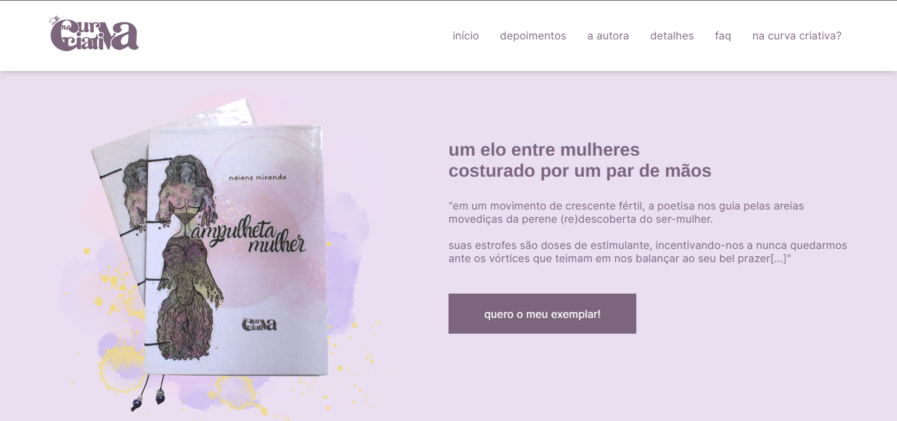

# Página de apresentação e vendas do livro de poemas Ampulheta Mulher

## Descrição

Este projeto é um site de apresentação e venda do meu livro artesanal de poemas: Ampulheta Mulher. 

Nele, apresento o livro e meu projeto criativo, me apresento como autora, disponibilizo depoimentos de leitoras que já tiveram contato com a obra e informações de encomenda. 

Sua funcionalidade é *apresentar informações no navegador*, sendo da stack *front-end*.

### tecnologias utilizadas

O layout inicial foi feito utilizando o Figma e pode ser acessado através do seguinte link:
[layout no figma](https://www.figma.com/file/Pa9Gh5Zwo2JLcOsQtc6Zvq/layout-de-landing-page-para-meu-livro?type=design&node-id=0%3A1&mode=design&t=YLLoaLHJxaVY6oSS-1)

Edição e design de imagens e animações: Gimp, Krita e Canva.
Código: HTML, CSS, JavaScript e a biblioteca scrollReveal.

## inicialização

Para inicializar este projeto localmente, basta cloná-lo em sua máquina e acessar utilizando o navegador de sua preferência. Não é necessário fazer o download de nenhuma ferramenta ou biblioteca específica.

## status

O site já está finalizado e pode ser acessado através do seguinte link: 

[Acessar Projeto Publicado - Ampulheta Mulher](https://naianemirandaa.github.io/ampulhetaMulher/)

Caso tenha algum elogio ou crítica construtiva sobre o projeto, sinta-se à vontade para entrar em contato comigo via [linkedIn](https://www.linkedin.com/in/naianemirandadejesus/) 🦋